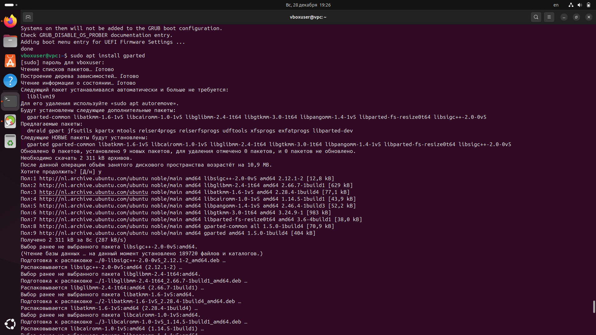
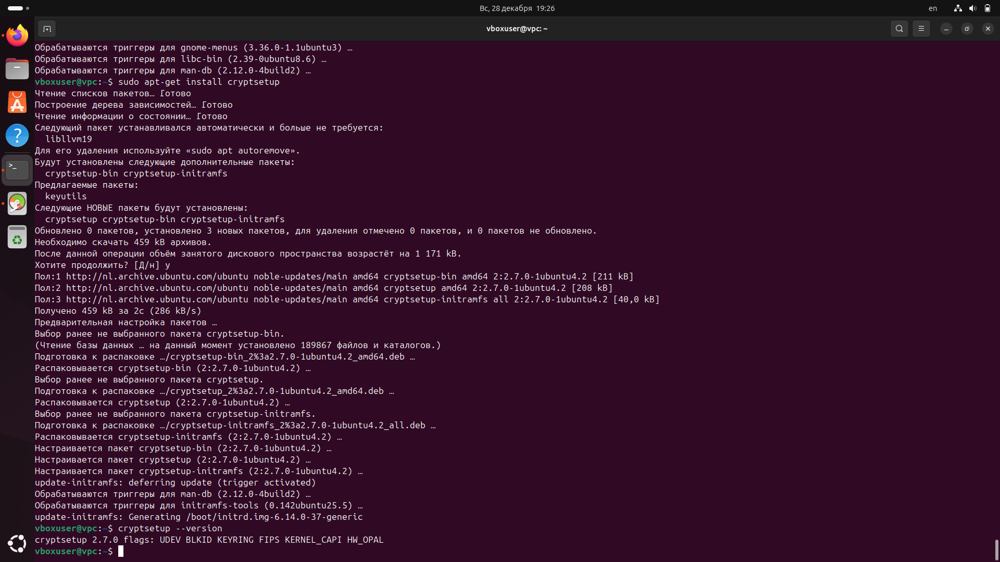
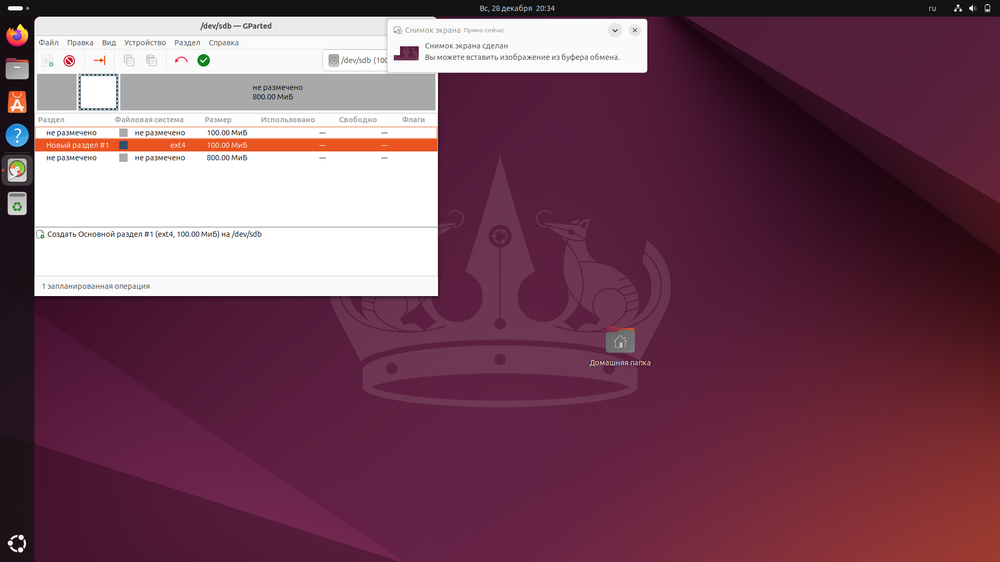
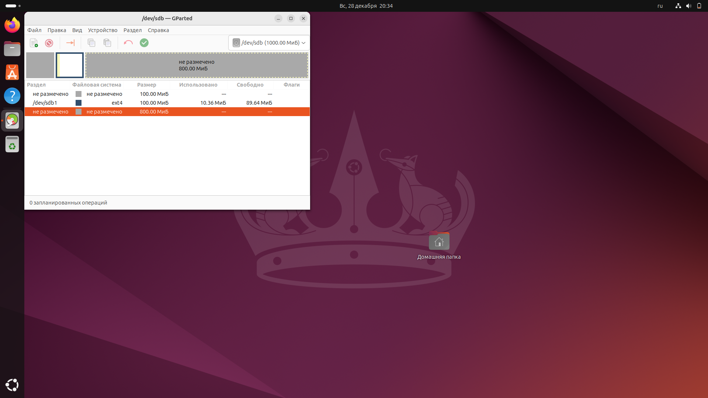
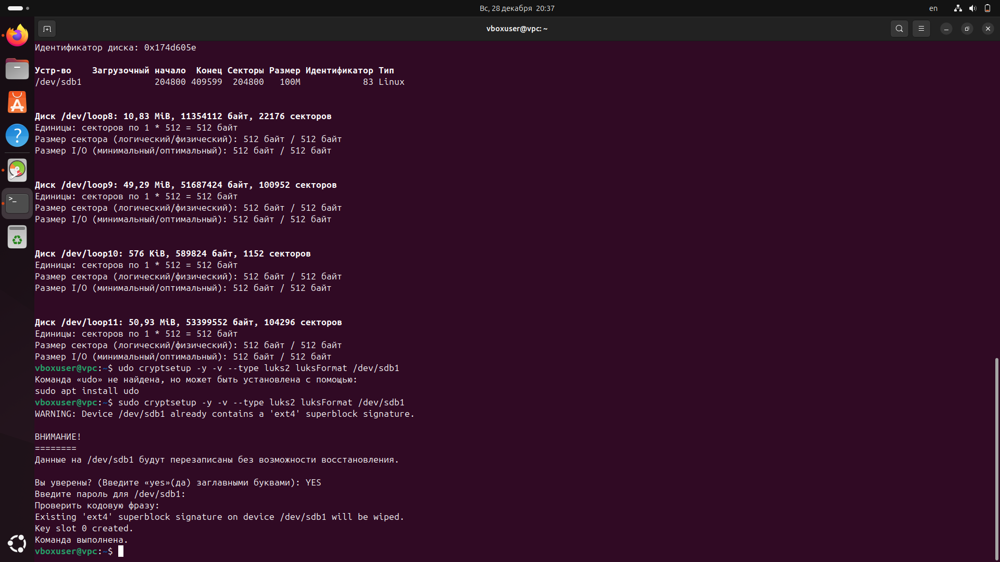
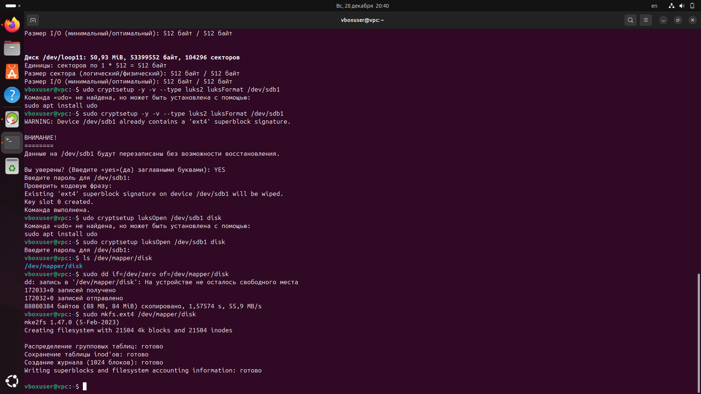
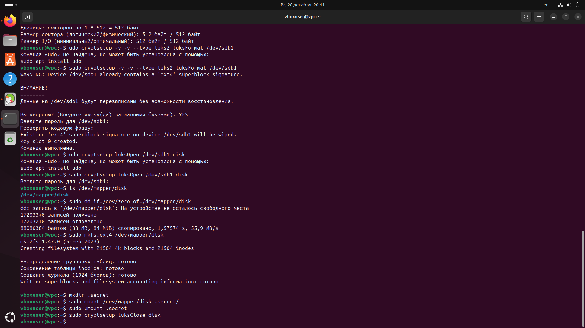

Домашнее задание к занятию «Защита хоста» - Алексей Заруцкий
Инструкция по выполнению домашнего задания

    Сделайте fork репозитория c шаблоном решения к себе в Github и переименуйте его по названию или номеру занятия, например, https://github.com/имя-вашего-репозитория/gitlab-hw или https://github.com/имя-вашего-репозитория/8-03-hw).
    Выполните клонирование этого репозитория к себе на ПК с помощью команды git clone.
    Выполните домашнее задание и заполните у себя локально этот файл README.md:
        впишите вверху название занятия и ваши фамилию и имя;
        в каждом задании добавьте решение в требуемом виде: текст/код/скриншоты/ссылка;
        для корректного добавления скриншотов воспользуйтесь инструкцией «Как вставить скриншот в шаблон с решением»;
        при оформлении используйте возможности языка разметки md. Коротко об этом можно посмотреть в инструкции по MarkDown.
    После завершения работы над домашним заданием сделайте коммит (git commit -m "comment") и отправьте его на Github (git push origin).
    Для проверки домашнего задания преподавателем в личном кабинете прикрепите и отправьте ссылку на решение в виде md-файла в вашем Github.
    Любые вопросы задавайте в разделе «Вопросы по заданию» в личном кабинете.

Желаем успехов в выполнении домашнего задания.
Задание 1

    Установите eCryptfs.
    Добавьте пользователя cryptouser.
    Зашифруйте домашний каталог пользователя с помощью eCryptfs.

В качестве ответа пришлите снимки экрана домашнего каталога пользователя с исходными и зашифрованными данными.
Задание 2

    Установите поддержку LUKS.
    Создайте небольшой раздел, например, 100 Мб.
    Зашифруйте созданный раздел с помощью LUKS.

В качестве ответа пришлите снимки экрана с поэтапным выполнением задания.
Дополнительные задания (со звёздочкой*)

Эти задания дополнительные, то есть не обязательные к выполнению, и никак не повлияют на получение вами зачёта по этому домашнему заданию. Вы можете их выполнить, если хотите глубже шире разобраться в материале
Задание 3 *

    Установите apparmor.
    Повторите эксперимент, указанный в лекции.
    Отключите (удалите) apparmor.

В качестве ответа пришлите снимки экрана с поэтапным выполнением задания.

# Решение

## Задание 1

## Задание 2

