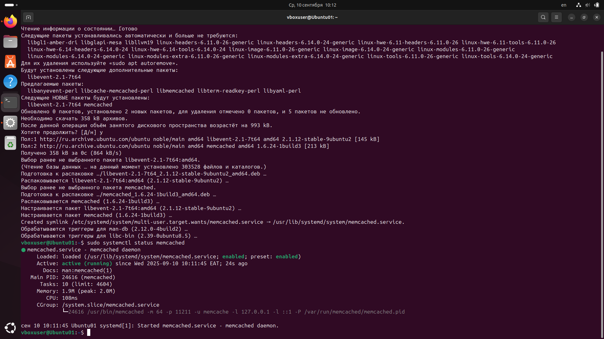
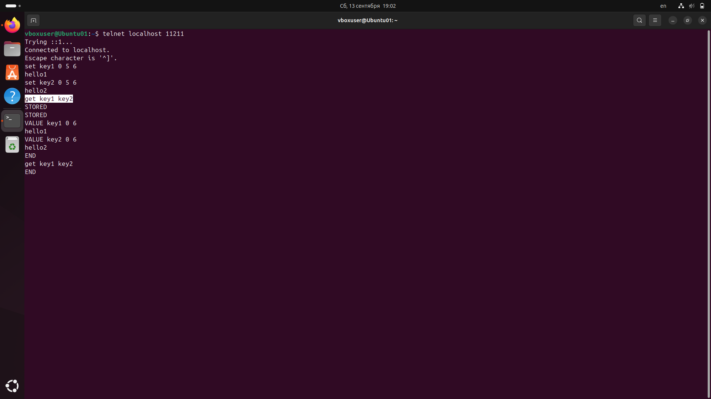
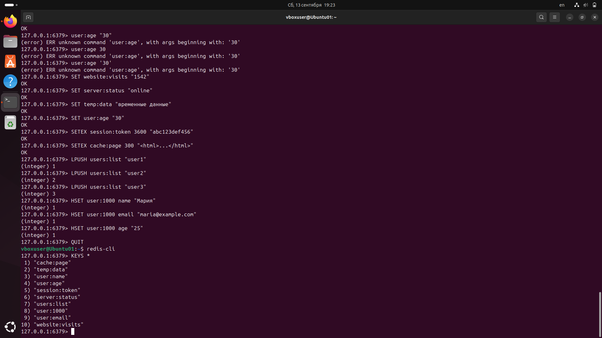
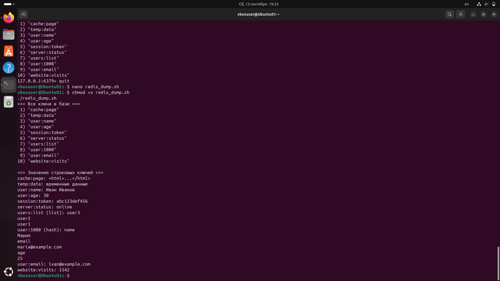

Домашнее задание к занятию «Кеширование Redis/memcached» Заруцкий Алексей
Инструкция по выполнению домашнего задания

    Сделайте fork репозитория c шаблоном решения к себе в Github и переименуйте его по названию или номеру занятия, например, https://github.com/имя-вашего-репозитория/gitlab-hw или https://github.com/имя-вашего-репозитория/8-03-hw).
    Выполните клонирование этого репозитория к себе на ПК с помощью команды git clone.
    Выполните домашнее задание и заполните у себя локально этот файл README.md:
        впишите вверху название занятия и ваши фамилию и имя;
        в каждом задании добавьте решение в требуемом виде: текст/код/скриншоты/ссылка;
        для корректного добавления скриншотов воспользуйтесь инструкцией «Как вставить скриншот в шаблон с решением»;
        при оформлении используйте возможности языка разметки md. Коротко об этом можно посмотреть в инструкции по MarkDown.
    После завершения работы над домашним заданием сделайте коммит (git commit -m "comment") и отправьте его на Github (git push origin).
    Для проверки домашнего задания преподавателем в личном кабинете прикрепите и отправьте ссылку на решение в виде md-файла в вашем Github.
    Любые вопросы задавайте в чате учебной группы и/или в разделе «Вопросы по заданию» в личном кабинете.

Желаем успехов в выполнении домашнего задания.
Задание 1. Кеширование

Приведите примеры проблем, которые может решить кеширование.

Приведите ответ в свободной форме.
Задание 2. Memcached

Установите и запустите memcached.

Приведите скриншот systemctl status memcached, где будет видно, что memcached запущен.
Задание 3. Удаление по TTL в Memcached

Запишите в memcached несколько ключей с любыми именами и значениями, для которых выставлен TTL 5.

Приведите скриншот, на котором видно, что спустя 5 секунд ключи удалились из базы.
Задание 4. Запись данных в Redis

Запишите в Redis несколько ключей с любыми именами и значениями.

Через redis-cli достаньте все записанные ключи и значения из базы, приведите скриншот этой операции.
Дополнительные задания (со звёздочкой*)

Эти задания дополнительные, то есть не обязательные к выполнению, и никак не повлияют на получение вами зачёта по этому домашнему заданию. Вы можете их выполнить, если хотите глубже разобраться в материале.
Задание 5*. Работа с числами

Запишите в Redis ключ key5 со значением типа "int" равным числу 5. Увеличьте его на 5, чтобы в итоге в значении лежало число 10.

Приведите скриншот, где будут проделаны все операции и будет видно, что значение key5 стало равно 10.

# Решение

## Задание 1.
1. Проблема: Высокая нагрузка на базу данных 

Суть проблемы: Частые и повторяющиеся запросы к БД (особенно сложные SELECT с джойнами) могут привести к тому, что база данных станет узким местом. CPU и IOPS дисков на сервере БД загружены под 100%, что увеличивает время отклика для всех пользователей.

Как решает кеширование:
Кеш (часто in-memory, типа Redis или Memcached) хранит результаты этих частых запросов. Вместо того чтобы каждый раз обращаться к БД, приложение сначала проверяет, есть ли ответ в кеше.

Пример:

До: У вас новостной сайт. На главной странице отображается список последних 10 статей. Каждый раз, когда любой пользователь заходит на главную, CMS делает запрос к БД SELECT * FROM posts ORDER BY date DESC LIMIT 10;. При 1000 запросах в минуту — это 1000 одинаковых запросов к БД.

После: Результат этого запроса сохраняется в Redis с ключом homepage:latest_posts на 60 секунд. Все следующие 1000 запросов в течение этой минуты будут получать данные из оперативной памяти Redis. Нагрузка на БД падает в сотни раз.

2. Проблема: Низкая скорость ответа приложения (High Latency)

Суть проблемы: Пользователи жалуются, что "сайт тормозит". Это может быть связано с медленными внутренними или внешними API, тяжелыми вычислениями или просто географической удаленностью пользователя от серверов.

Как решает кеширование:
Кеширование сохраняет готовый ответ и отдает его практически мгновенно, так как данные лежат в быстрой оперативной памяти (RAM), а не генерируются на лету.

Пример:
Внешний API: Ваше приложение показывает курсы валют, обращаясь к внешнему поставщику данных (например, Центробанку). Его API может отвечать 500 мс, и обновлять данные нужно лишь раз в день.

        Решение: Запросили курс у ЦБ — сохранили в кеш на 12-24 часа. Все пользователи получают ответ из кеша за ~1 мс.

    Сложные вычисления: На сайте есть отчет "Итоги года", который строится 5 секунд из-за сложной агрегации данных в БД.

        Решение: Сгенерировали отчет один раз, сохранили результат в кеш на 1 час. Все пользователи видят его моментально.

3. Проблема: Риск отказа при скачках трафика (Traffic Spikes)

Суть проблемы: Ваш сайт попал на главную страницу HackerNews или Reddit ("Эффект Слашдота"). Резкий всплеск трафика, с которым не справляется backend (БД и приложение), приводит к отказу в обслуживании (HTTP 500 errors).

Как решает кеширование:
Кеширование на уровне приложения (как выше) и, что еще важнее, кеширование на уровне веб-сервера (HTTP-кеш) принимает на себя основной удар.

Пример:

    Nginx/Apache Caching: Можно настроить веб-сервер так, чтобы он кешировал целиком статические страницы (или даже динамические, если они не персонифицированы) для анонимных пользователей.

    CDN (Content Delivery Network): Это глобальное распределенное кеширование. Статичные файлы (CSS, JS, картинки) и даже HTML-страницы раздаются с сервера, географически ближайшего к пользователю. Это не только снимает ~90% нагрузки с вашего исходного сервера, но и ускоряет загрузку для конечных пользователей.

4. Проблема: Избыточная нагрузка на бэкенд-сервисы (API, микросервисы)

Суть проблемы: В микросервисной архитектуре один сервис может зависеть от ответов десятка других. Если один из этих сервисов медленный или временно недоступен, это вызывает цепную реакцию и падение всего функционала.

Как решает кеширование:
Кеширование ответов этих сервисов (т.н. "Circuit Breaker" pattern) позволяет:

    Ускорить ответ: Использовать актуальные кешированные данные.

    Повысить отказоустойчивость: Если бэкенд-сервис "упал", можно отдать чуть устаревшие данные из кеша, а не показывать пользователю ошибку "Сервис временно недоступен". Это лучше, чем ничего.

Пример:

Сервис "корзины товаров" зависит от сервиса "каталога", чтобы показать актуальное название и цену товара. Если сервис "каталога" лежит, можно на 5-10 минут отдать данные из его последнего успешного ответа, сохраненного в кеше, пока инженеры не починят проблему.

5. Проблема: Повторные дорогостоящие вычисления (Redundant Calculations)

Суть проблемы: Одно и то же действие, требующее много CPU/GPU ресурсов, выполняется многократно без необходимости.

Как решает кеширование:
Результат вычисления сохраняется, и последующие запросы используют уже готовый результат.

Пример:
Генерация миниатюр изображений. Загрузили изображение 10Мп — сервер создал thumbnails (100x100, 500x500) и сохранил их на диск. В дальнейшем эти превью отдаются сразу, а не генерируются заново для каждого запроса.

Рендеринг шаблонов. Части страницы (хедер, футер, сайдбар), которые не меняются между сессиями пользователей, можно закешировать в скомпилированном виде.

## Задание 2.

## Задание 3.

## Задание 4.

